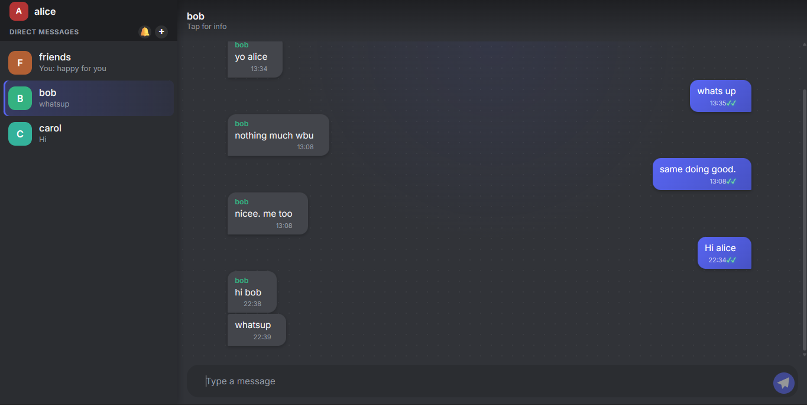
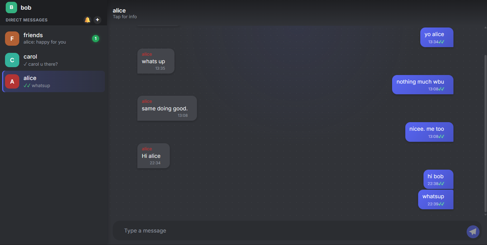

# Chat App

**Live demo:** [Chat App](https://chat-app-pw.vercel.app)
*(Note: the backend is on a free-tier host and may take up to a minute to wake up on first load.)*

A real-time chat application with authentication, DMs, groups, friend requests, and live messaging — built with React, Node/Express, Socket.IO, and MongoDB.

- [`/client`](./client) — React frontend ([setup instructions](./client/README.md))
- [`/server`](./server) — Express + Socket.IO backend ([setup instructions](./server/README.md))

## Quick start

1. Set up and run the backend: see `server/README.md`
2. Set up and run the frontend: see `client/README.md`
3. Visit the frontend URL in your browser

## Known limitations

- **No refresh tokens** — JWTs expire after 7 days with no silent renewal; users are simply logged out and must sign in again. A deliberate scope decision for a project at this size.
- **Message editing has a 15-minute window** — matching WhatsApp's convention; messages older than that can only be deleted, not edited.
- **No "delete for me" option** — message deletion is permanent and visible to everyone in the conversation, by design.
- **Deleted accounts aren't fully erased from history** — a deleted user's past messages remain visible (shown under their old username) in any conversation that isn't itself deleted, since removing them would corrupt other members' chat history. DMs with a deleted user can be removed entirely via "Delete chat."
- **Free-tier hosting cold starts** — the backend (Render free tier) sleeps after ~15 minutes of inactivity; the first request after that can take up to a minute to respond. The login screen detects this and shows a "waking up" message rather than appearing frozen.
- **No group invite links yet** — new members are added directly by any existing group member; link-based invites are a possible future addition.